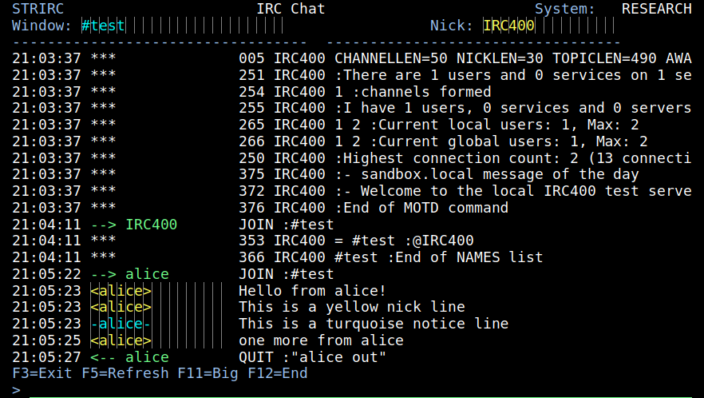
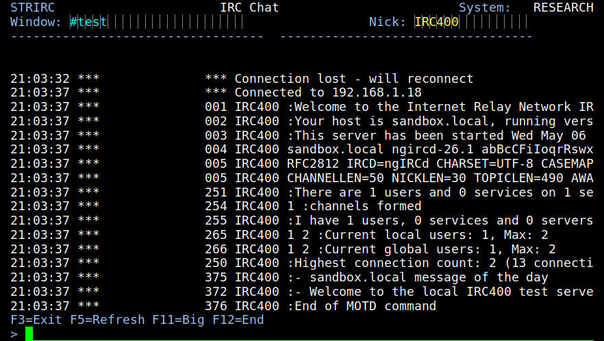
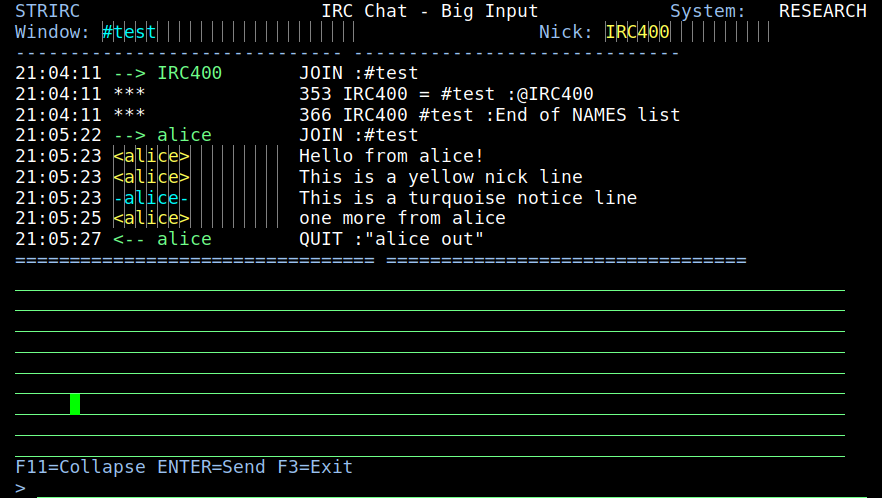
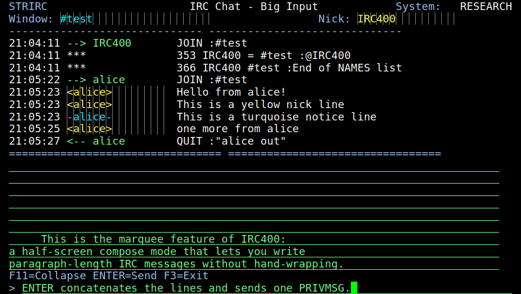

<p align="center">
  An IRC client for IBM AS/400 / OS/400, written in ILE C and CL, with a native 5250 chat panel and a half-screen compose mode for long messages.
  <br>
  
  <br>
</p>

IRC400 runs on green-screen OS/400. The chat panel paints in pure DDS, the network engine is a separate ILE C batch job, and the two cooperate through OS/400 data queues and a circular `MSGBUF` physical file. Targets V4R5 and later; tested on V4R5 and V5R4.



## Features

 - [x] Native 5250 chat panel — 19 chat lines and a 1-line input field, painted from a circular `MSGBUF` physical file.
 - [x] Two-job architecture decoupling block-mode 5250 from full-duplex IRC:
    + [x] `IRCNETD` (batch ILE C) — owns the TCP socket, parses RFC 2812, writes events to `MSGBUF`.
    + [x] `IRCCHATC` (interactive CL) — paints the chat panel, dispatches user input through `IRCOUTQ`.
 - [x] EBCDIC ↔ ASCII translation on the wire (CCSID 37 ↔ 819) so the AS/400 talks plain IRC to any standard server.
 - [x] mIRC formatting bytes stripped before display (`\x02` bold, `\x03NN[,MM]` color, `\x0F` reset, `\x16` reverse, `\x1D/\x1E/\x1F`).
 - [x] Per-kind nick coloring on every chat row:
    + [x] PRIVMSG / ACTION → yellow
    + [x] JOIN / PART / QUIT / TOPIC → green
    + [x] NOTICE → turquoise
    + [x] system / numerics → white
 - [x] Slash commands: `/quit [reason]`, `/quote <raw>`, `/join #channel`.
 - [x] **F11 half-screen compose mode** — toggles to a 9-line input area for long messages, with the latest 9 chat lines kept visible in a split view above. ENTER concatenates and sends as one PRIVMSG; F11 collapses without sending; leading whitespace is trimmed.
 - [x] Live screen refresh on inbound IRC traffic via a data-queue wakeup from the engine to `IRCEVTQ`.
 - [x] One-command FTP+RCMD deployment: `./deploy.sh <host> <user> <password>`.
 - [ ] Multi-window support (`/win N`, status + channels + PMs) — Phase 8.
 - [ ] QSN / DSM live-refresh-while-typing — Phase 5b (deferred).
 - [ ] SASL auth.

## Installation

IRC400 is deployed onto the AS/400 with the bundled `deploy.sh` script. It uses FTP + remote `RCMD` to create the `IRCCLIENT` library, transfer all sources, and run the `BUILD` program on the target.

```
$ ./deploy.sh <host> <user> <password>
```

Example:

```
$ ./deploy.sh 192.168.1.101 QSECOFR QSECOFR0
```

Prerequisites on the AS/400:

 + OS/400 V4R5 or later.
 + ILE C compiler (5769-WDS option 51).
 + Option 13 (System Openness Includes) installed.
 + TCP/IP and FTP server active (`STRTCP`, `STRTCPSVR *FTP`).
 + A user profile with `*ALLOBJ` authority (or sufficient rights on `IRCCLIENT`).

## Usage

After deployment, sign on to the AS/400 and run:

```
ADDLIBLE LIB(IRCCLIENT)
STRIRC NICK(<nick>) SERVER('<host>') PORT(<port>) CHAN('<channel>')
```

The full command syntax:

```
STRIRC -- Start IRC client
  NICK    nickname              (CHAR  32, required)
  SERVER  host or dotted IP     (CHAR  64, default 'irc.libera.chat')
  PORT    port number           (DEC 5 0,  default 6667)
  CHAN    auto-join channel     (CHAR  64, default '#test')
```

In the chat panel (small mode):

| Input              | Effect                                            |
|--------------------|---------------------------------------------------|
| any plain text     | `PRIVMSG` to the current channel                  |
| `/quit [reason]`   | Send `QUIT` and end the session cleanly           |
| `/quote <raw>`     | Inject any raw IRC command (escape hatch)         |
| `/join #channel`   | `JOIN` a channel                                  |
| `F3` / `F12`       | Exit                                              |
| `F5`               | Force-refresh the chat region                     |
| `F11`              | Toggle to big input mode                          |

In big input mode (after F11):

| Input    | Effect                                                                |
|----------|-----------------------------------------------------------------------|
| `ENTER`  | Concat the 9 input lines, send as one `PRIVMSG`, return to small mode |
| `F11`    | Collapse to small mode without sending                                |
| `F3`     | Exit                                                                  |

## Example

 + Connect to a public IRC server and join a channel:

    ```
    ADDLIBLE LIB(IRCCLIENT)
    STRIRC NICK(test400) SERVER('irc.libera.chat') CHAN('#test')
    ```

 + The chat panel just after the IRC handshake completes (server numerics 001-005 + MOTD), with the channel name and nick in the header strip:

    

 + Watch live JOIN / QUIT / PRIVMSG / NOTICE land in the chat panel with per-kind nick coloring — yellow for PRIVMSGs, green for JOIN/QUIT, turquoise for NOTICE, white for system numerics:

    

 + Press `F11` to switch into split-view compose mode. The latest 9 chat lines stay visible above the separator, and 9 input lines open below for composing a paragraph-length message:

    

 + Type your message across as many of the 9 lines as you need; `ENTER` concatenates them with single spaces between segments, trims surrounding whitespace, and sends a single `PRIVMSG` to the current channel. `F11` collapses without sending:

    

## Contributing

Pull requests are welcome. Feel free to open an issue if you want to add other features.
