# Design

How the pieces of IRC400 fit together at runtime, and what each one is responsible for. Pair this with [`datalayout.md`](./datalayout.md) for the persistent-state schema.

## Two-job model

The hard architectural constraint is that 5250 block-mode I/O is half-duplex (the workstation only paints in response to an AID round-trip), while IRC is full-duplex. The client therefore runs as **two cooperating jobs**:

- **`IRCNETD`** — a batch ILE C job. Owns the TCP socket, parses RFC 2812, writes one record per inbound line to `MSGBUF`, then pings the UI on `IRCEVTQ`.
- **`IRCCHATC`** — an interactive CL job. Owns the 5250 device. Reads `MSGBUF` through `IRCCHATL`, paints `IRCCHATD`, and dispatches user input as commands on `IRCOUTQ`.

Neither job ever calls the other directly. All cross-job traffic flows through two OS/400 data queues and one shared physical file.

## Component graph

```mermaid
graph LR
    User([User on 5250 terminal])

    subgraph cmd["Command + launcher"]
        STRIRC["STRIRC<br/><i>strirc.cmd</i><br/>command def"]
        STRIRCC["STRIRCC<br/><i>strircc.clp</i><br/>controller"]
    end

    subgraph ui["UI job (interactive CL)"]
        IRCCHATC["IRCCHATC<br/><i>ircchatc.clp</i><br/>chat panel controller"]
        IRCCHATL["IRCCHATL<br/><i>ircchatl.c</i><br/>chat-line loader"]
        IRCCHATD["IRCCHATD<br/><i>ircchatd.dspf</i><br/>DSPF: CHATOUT / CHATIN / CHATBIG"]
    end

    subgraph engine["Engine job (batch ILE C)"]
        IRCNETD["IRCNETD<br/><i>ircnetd.c</i><br/>network engine"]
        IRCFMT["IRCFMT<br/><i>ircfmt.c</i><br/>mIRC strip + color hint<br/><b>bound module</b>"]
        IRCBUFM["IRCBUFM<br/><i>ircbufm.c</i><br/>MSGBUF CRUD helper"]
    end

    subgraph srv["Server admin (out of band)"]
        IRCSRVM["IRCSRVM<br/><i>ircsrvm.c</i><br/>IRCSRVR CRUD helper"]
    end

    subgraph state["Persistent state (IRCCLIENT lib)"]
        IRCCONF[("IRCCONF<br/>data area<br/>CHAR(512)")]
        MSGBUF[("MSGBUF PF<br/>circular log")]
        IRCSRVR[("IRCSRVR PF<br/>saved servers")]
        IRCWINR[("IRCWINR PF<br/>open windows")]
    end

    subgraph queues["Data queues"]
        IRCOUTQ{{"IRCOUTQ<br/>UI &rarr; engine<br/>MAXLEN 512"}}
        IRCEVTQ{{"IRCEVTQ<br/>engine + DSPF &rarr; UI<br/>MAXLEN 80"}}
    end

    IRCD([IRC server<br/>TCP / RFC 2812])

    User -->|"STRIRC NICK SERVER PORT CHAN"| STRIRC
    STRIRC -->|CRTCMD binding| STRIRCC
    STRIRCC -->|SBMJOB| IRCNETD
    STRIRCC -->|"QSNDDTAQ<br/>'CJOIN #chan'"| IRCOUTQ
    STRIRCC -->|CALL with NICK/CHAN| IRCCHATC
    STRIRCC -->|"QSNDDTAQ 'X'<br/>safety on exit"| IRCOUTQ

    IRCCHATC -->|DCLF + SNDF/RCVF| IRCCHATD
    IRCCHATC -->|"OVRDSPF DTAQ()<br/>so AID lands on IRCEVTQ"| IRCEVTQ
    IRCCHATC -->|"QRCVDTAQ<br/>2s timeout"| IRCEVTQ
    IRCCHATC -->|"CALL PWIN, CHATBUF, KINDBUF"| IRCCHATL
    IRCCHATC -->|"QSNDDTAQ<br/>'CPRIVMSG …' / 'CJOIN …' / 'X'"| IRCOUTQ
    IRCCHATD <-->|5250 data stream| User
    IRCCHATL -->|"_Ropen / _Rreadn"| MSGBUF

    IRCNETD <-->|TCP socket<br/>EBCDIC&#x2194;ASCII CCSID 37/819| IRCD
    IRCNETD -->|"calls bound module"| IRCFMT
    IRCNETD -->|"_Rwrite append<br/>(also can CALL IRCBUFM)"| MSGBUF
    IRCBUFM -->|"_Rwrite / _Rreadk / _Rdelete"| MSGBUF
    IRCNETD -->|"QSNDDTAQ 'X' wake"| IRCEVTQ
    IRCNETD -->|"QRCVDTAQ poll"| IRCOUTQ
    IRCNETD -.->|"reads / writes<br/>conn_state, nick"| IRCCONF
    IRCCHATC -.->|"reads / writes<br/>input_mode, last_painted_seq"| IRCCONF

    IRCSRVM -->|"_Rwrite / _Rupdate / _Rdelete"| IRCSRVR
    IRCNETD -.->|"future: window add/remove"| IRCWINR
    IRCCHATC -.->|"future: /win N"| IRCWINR

    classDef job fill:#1f3a5f,stroke:#88aacc,color:#e8eef5
    classDef helper fill:#2d4a2f,stroke:#88cc88,color:#e8f5e8
    classDef store fill:#4a3a1f,stroke:#ccaa66,color:#f5ecd8
    classDef queue fill:#4a1f3a,stroke:#cc66aa,color:#f5d8ec
    classDef ext fill:#1f1f1f,stroke:#888,color:#ddd

    class IRCCHATC,IRCNETD,STRIRCC job
    class IRCCHATL,IRCFMT,IRCBUFM,IRCSRVM,IRCCHATD,STRIRC helper
    class IRCCONF,MSGBUF,IRCSRVR,IRCWINR store
    class IRCOUTQ,IRCEVTQ queue
    class User,IRCD ext
```

## Component responsibilities

### Launcher

**`STRIRC` (command, `strirc.cmd`)** — declares the four parameters (`NICK`, `SERVER`, `PORT`, `CHAN`) with defaults and prompt text. `CRTCMD` binds it to `STRIRCC`.

**`STRIRCC` (CL, `strircc.clp`)** — drains stale entries from `IRCOUTQ` so a leftover safety-`X` from a prior session can't kill the engine we're about to launch, then `SBMJOB`s `IRCNETD`, sleeps 15 s for registration, queues an auto-`CJOIN`, and `CALL`s `IRCCHATC`. After `IRCCHATC` returns it pushes a final `X` to `IRCOUTQ` as a belt-and-braces shutdown.

### Engine job

**`IRCNETD` (ILE C, `ircnetd.c`)** — owns one TCP socket. Resolves DNS with a watchdog, registers (`NICK` + `USER`), and runs a select loop that polls the socket, `IRCOUTQ`, and the reconnect timer. For every inbound line it translates EBCDIC↔ASCII, hands the body to `ircfmt_clean()` to strip mIRC formatting, appends a `MSGBUF` record, and posts a 1-byte `X` to `IRCEVTQ` so the UI wakes promptly. Exponential backoff (5/10/30/60 s) on lost connections, interruptible by `X` on `IRCOUTQ`.

**`IRCFMT` (ILE C module, `ircfmt.c`)** — pure function `ircfmt_clean()` that strips `\x02` bold, `\x03NN[,MM]` color, `\x0F` reset, `\x16` reverse, `\x1D/\x1E/\x1F`, and emits a single dominant color hint for `MBNCOL`. Bound into `IRCNETD` at `CRTPGM` time, not its own `*PGM`.

**`IRCBUFM` (ILE C, `ircbufm.c`)** — record-level CRUD on `MSGBUF` (Append, Read-by-seq, Next, Trim, Count). Exists because OPM CL can't write/update/delete PF records natively. Both jobs can call it; in practice `IRCNETD` opens `MSGBUF` directly via `_Rwrite` for performance and only the maintenance paths go through `IRCBUFM`.

### UI job

**`IRCCHATC` (CL, `ircchatc.clp`)** — paints, reads, dispatches. Each iteration calls `IRCCHATL` to refresh the 19-row chat buffer, fans the buffer into ~60 DSPF fields plus per-row color indicators, `SNDF`s the appropriate record format (`CHATOUT`+`CHATIN` in small mode, `CHATBIG` in F11 big mode), and `QRCVDTAQ`s `IRCEVTQ` with a 2 s timeout. The `OVRDSPF FILE(IRCCHATD) DTAQ(IRCEVTQ)` is what makes AID-key presses land on `IRCEVTQ` as 80-byte entries — the same queue the engine pings with 1-byte `X` wakes. The first byte distinguishes them. Slash commands (`/quit`, `/quote`, `/join`) and big-mode 9-line concat all encode as `'C<raw IRC line>'` or `'X'` and go onto `IRCOUTQ`.

**`IRCCHATL` (ILE C, `ircchatl.c`)** — opens `MSGBUF` read-only, walks all records matching the requested window seq, keeps the latest 19 in a ring buffer, and emits a 1444-byte `CHATBUF` (19 × 76 chars: timestamp / nick segment / message body) plus a 57-byte `KINDBUF` (3 bits per row driving DDS conditional `COLOR` keywords for nick coloring).

**`IRCCHATD` (DSPF, `ircchatd.dspf`)** — three record formats:
- `CHATOUT` rows 1–23: header strip + 19 chat lines + F-key legend.
- `CHATIN` row 24: the 1-line input field, INVITE, used in small mode.
- `CHATBIG` rows 13–23: separator + 9 stacked input fields `BIG01..BIG09`, INVITE, overlays `CHATOUT`'s lower half in F11 big mode.

### Out-of-band admin

**`IRCSRVM` (ILE C, `ircsrvm.c`)** — same shape as `IRCBUFM` but for `IRCSRVR` (saved server list). Used by the future "Work with IRC servers" panel; not called from the live chat path.

## Persistent state

See [`datalayout.md`](./datalayout.md) for field layouts. At a glance:

- **`IRCCONF`** (data area, CHAR 512) — shared between both jobs. Engine writes connection state and the actual current nick; UI writes settings and `last_painted_seq`. Currently consulted lightly; will be the basis for the Phase-5 "poll for connected" replacement of `STRIRCC`'s 15 s sleep.
- **`MSGBUF`** (PF) — the circular log of chat lines. Engine appends, UI reads, `IRCBUFM` trims. The `MBSEQ` / `MBWIN` keys plus the high/low water marks in `IRCCONF` make Phase-10 wrap tractable without scanning the whole file.
- **`IRCSRVR`** (PF) — saved IRC server entries. Touched only by `IRCSRVM` and the admin panel.
- **`IRCWINR`** (PF) — open windows (status, channels, PMs). Reserved for the multi-window phase; currently unused.

## Data queues

- **`IRCOUTQ`** (`MAXLEN(512)`, UI → engine): outbound IRC command lines. Two prefixes:
  - `C<raw IRC line>` — send the payload as one IRC line (CRLF appended by the engine).
  - `X` — engine sends `QUIT` and shuts down cleanly.
- **`IRCEVTQ`** (`MAXLEN(80)`, engine + DSPF → UI): two distinct senders share this queue.
  - The engine `QSNDDTAQ`s a 1-byte `X` after every `MSGBUF` append so the UI's `QRCVDTAQ` returns immediately.
  - The 5250 workstation enqueues an 80-byte AID entry on every screen submit, courtesy of `OVRDSPF FILE(IRCCHATD) DTAQ(IRCEVTQ)` in `IRCCHATC`. The UI inspects the entry length / first byte to tell wakes from real input.

## Lifecycle of one inbound message

1. IRC server sends `:nick!u@h PRIVMSG #chan :hello\r\n`.
2. `IRCNETD`'s select loop sees readable bytes, the line reader assembles one CRLF-terminated line, EBCDIC table converts the bytes, `ircfmt_clean()` strips formatting and returns `'Y'` (PRIVMSG).
3. `IRCNETD` builds an `MsgBufRec` with `MBKIND='M'`, `MBNCOL='Y'`, current `HH:MM:SS`, calls `_Rwrite` on `MSGBUF`.
4. `IRCNETD` does `QSNDDTAQ IRCEVTQ` with `'X'`, length 1.
5. `IRCCHATC` was blocked on `QRCVDTAQ IRCEVTQ` (2 s timer). It returns immediately, sees length=1 first-byte=`X`, and jumps to `REPAINT`.
6. `IRCCHATC` calls `IRCCHATL`, which reads `MSGBUF`, returns the 1444-byte `CHATBUF` and the 57-byte `KINDBUF`.
7. `IRCCHATC` fans the buffers into the DSPF fields, `SNDF CHATOUT`, loops back to `WAIT`.
8. The workstation paints the new line on the user's screen.

## Lifecycle of one outbound message

1. User types `hello` in `CHATIN` and presses ENTER.
2. The 5250 workstation enqueues an 80-byte AID-key entry on `IRCEVTQ` (because of `OVRDSPF DTAQ`).
3. `IRCCHATC`'s `QRCVDTAQ` returns. Length is 80, not 1, so it's a real submit. `RCVF CHATIN` pulls the input field.
4. `IRCCHATC` builds `'CPRIVMSG #chan :hello'` and `QSNDDTAQ`s it on `IRCOUTQ`.
5. `IRCNETD`'s outq poll picks it up, recognises the `C` prefix, EBCDIC→ASCII translates the payload, appends CRLF, and `send()`s on the socket.
6. The IRC server (and any echo back via the channel) is then a regular inbound message — see the lifecycle above.

## Why the design is shaped this way

- **Decoupling block-mode 5250 from full-duplex IRC.** A single program can't do both. Two jobs + a queue is the cheapest split; the alternatives (RPG with a separate display, native sockets in CL) either don't exist on V4R5 or are far worse.
- **`MSGBUF` as a PF rather than in-memory.** A PF survives engine restarts, lets the UI repaint cleanly after F5, and gives `IRCBUFM` something to trim against on wrap. The cost (PF write + read on every line) is negligible at IRC traffic rates.
- **Single `IRCEVTQ` carrying two kinds of entries.** Originally separate; collapsed because `OVRDSPF DTAQ` only takes one queue and we still need engine wakes to land on the same read. The first-byte / length discriminator is dirty but works on V4R5 without `Qsn*` calls.
- **`IRCFMT` as a bound module rather than a `*PGM`.** It's called per inbound line; the dynamic-call overhead would dominate. Bound into `IRCNETD` at `CRTPGM`.
- **CL for the UI, ILE C for the engine and helpers.** CL handles the DSPF I/O cycle declaratively (`DCLF` / `SNDF` / `RCVF`) which is what we want. ILE C gets us sockets, byte-level table translation, and PF record I/O which CL can't do.
